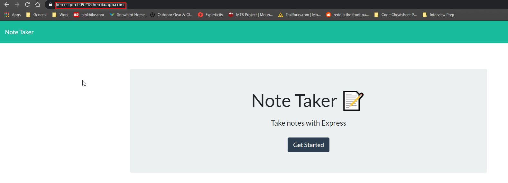
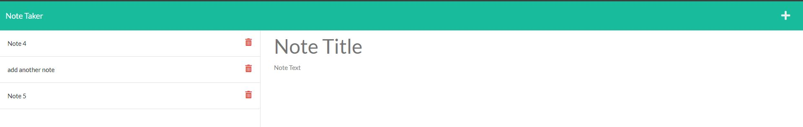
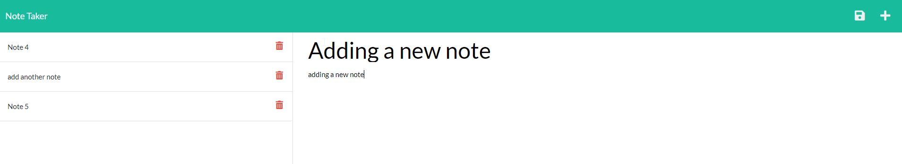
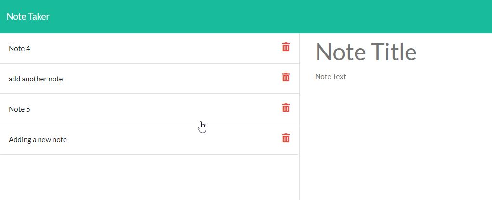
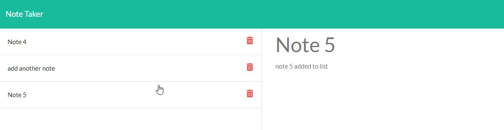
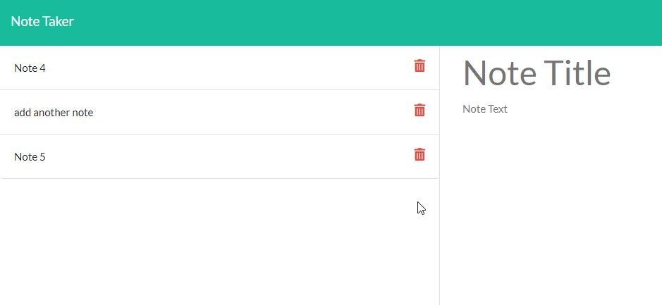

  # Note Taker 

  ## About/Description

  This application allows a user to write and save notes.  The notes are written to a JSON file so they can be retrieved anytime.  The application front end was already written so I worked to create the routes on server.js which implemented the functionality of the webpage.  This application uses express for the routes to function.   I also added uuid to the project to generate a unique id each time a new note is created.  This allows for the id on each note to help identify the index in the array when using the delete function of the app.  Finally this application uses Heroku to deploy to a live environment.

  ## Table of Contents

  * [Installation](#installation)
  * [Usage](#usage)
  * [Languages](#languages)
  * [Contributing](#contributing)
  * [License](#license)
  * [Tests](#tests)
  * [Questions](#questions)
  
  ## Installation

  Express and UUID were installed in order to make this function.  npm install should download the items required.

  ## Usage

  Clicking the live link https://fierce-fjord-09218.herokuapp.com/notes will open the live application

  ### Screenshots

  #### Main Page When Opening The Application

  

  #### Main Note Page 

  

  #### Adding A New Note

  

  #### Note Added After Clicking Save

  

  #### Note Displays When Clicked On

  

  #### Note Removed From List When Trash Button Clicked To Delete

  
  

  ## Languages

  JavaScript HTML CSS ES6 jQuery Bootstrap Express Node.js UUID Heroku

  ## Contributing

  Contributions by: David Shaw, start code provided by Bootcamp

  If you would like to contribute to this project we follow the [Contributor Covenant](https://www.contributor-covenant.org/)

  ## License

  https://choosealicense.com/licenses/mit/

  ## Tests

  none

  ## Questions:

  If you have any questions please contact us or refer to our github below:

  Email Us At: david.shaw1242@gmail.com

  Github Repo: https://github.com/ds1242/note-taker

